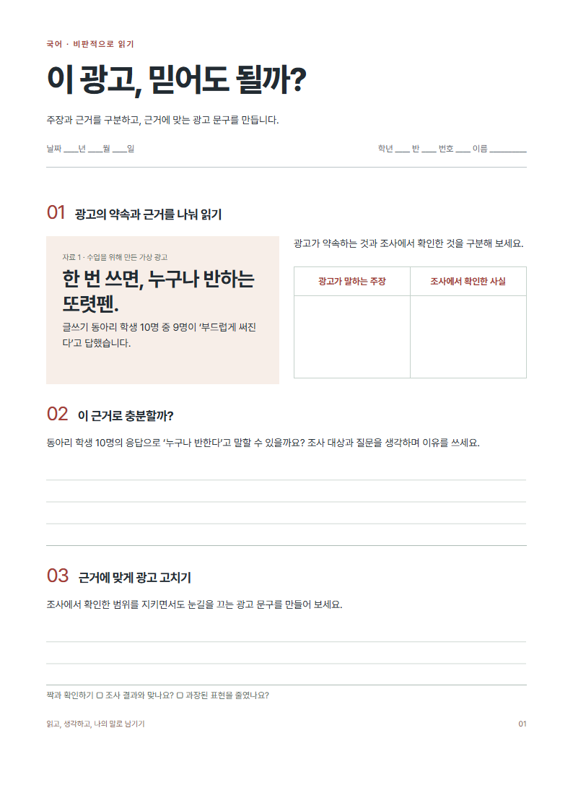
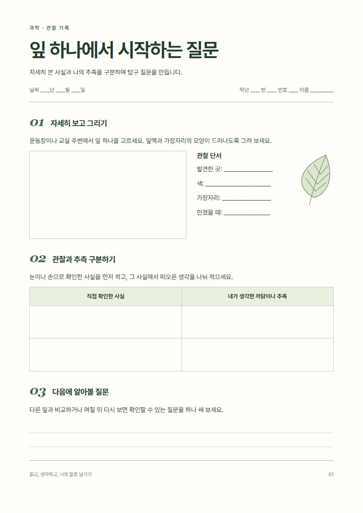
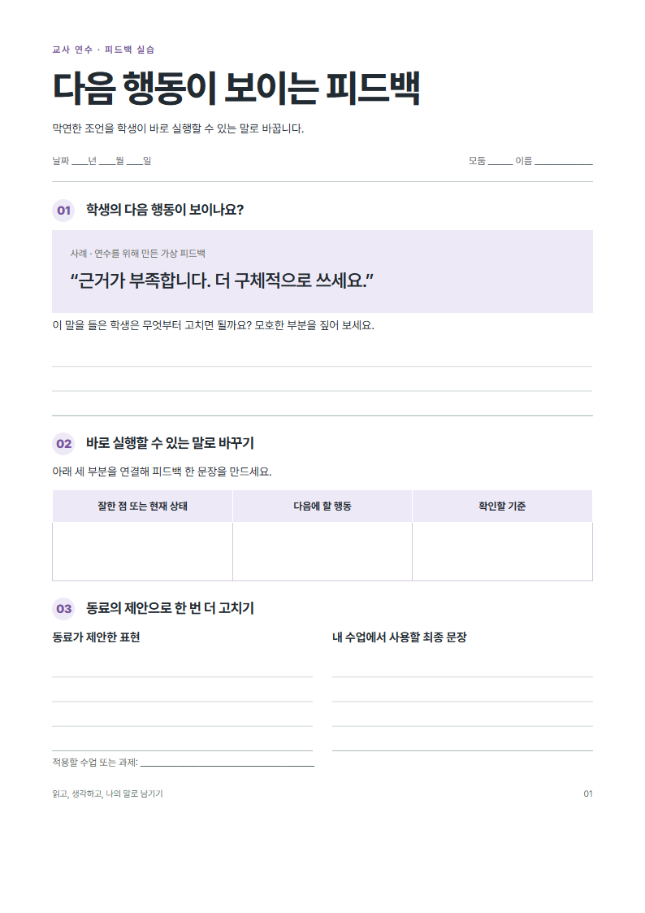
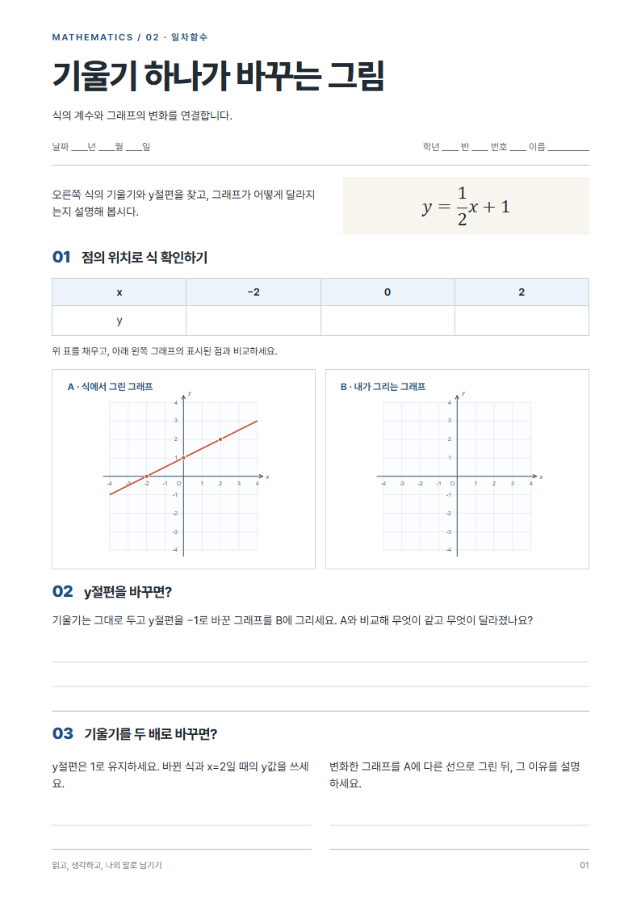
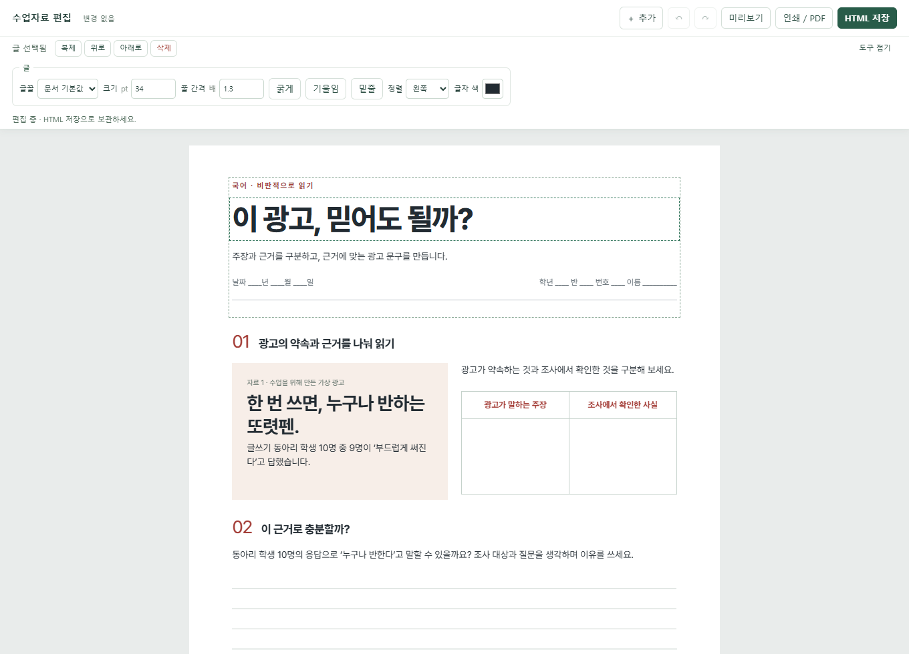
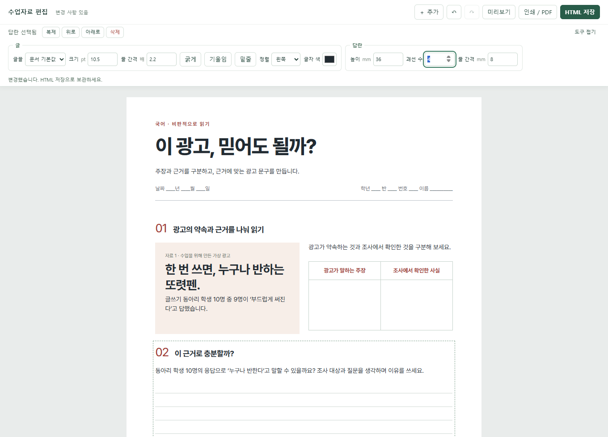
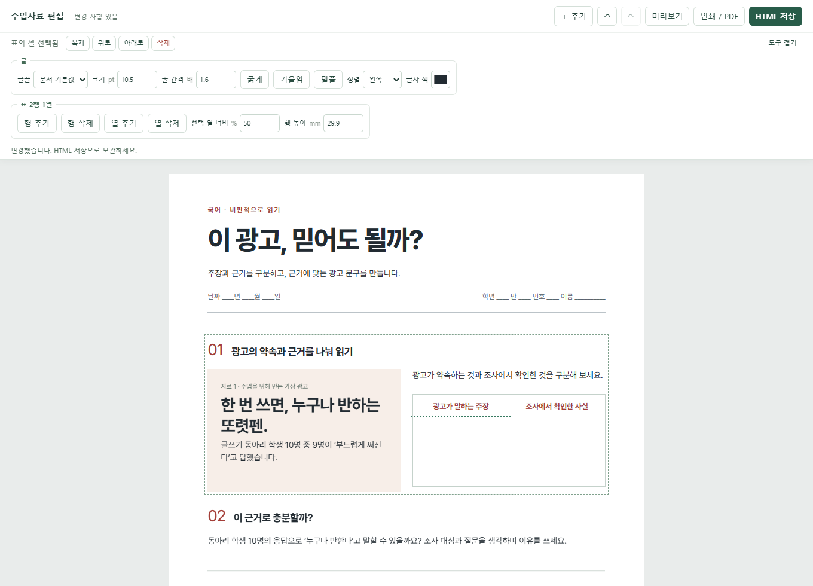
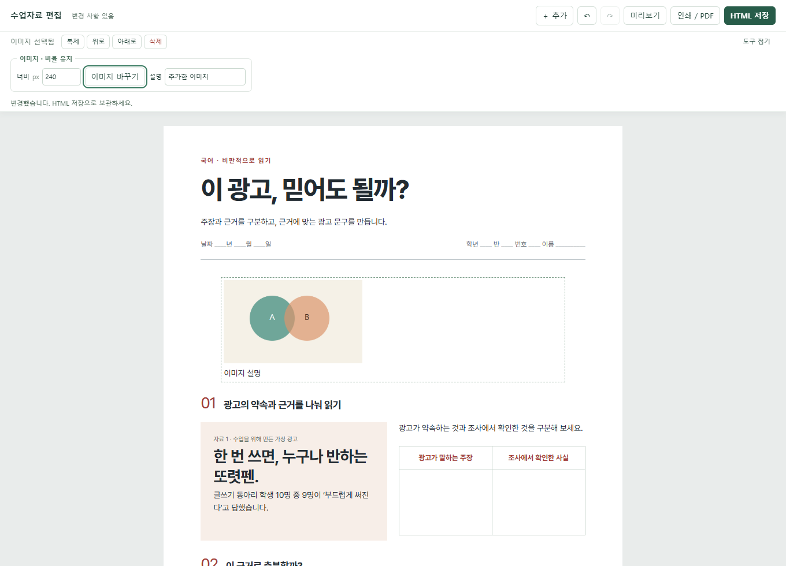

# Worksheet Craft

**수업에 필요한 활동지를 만들고, 브라우저에서 바로 고치세요.**

교사가 주제와 활동을 말하면 AI가 읽기 자료, 질문, 표, 답란을 갖춘 **편집 가능한 HTML 활동지**를 만드는 Claude·Claude Code·Codex에서 사용하는 스킬입니다. 학생 수업과 교사 연수에 모두 사용할 수 있습니다.

예를 들어 “중학교 국어 시간에 광고의 주장과 근거를 비교하고, 과장된 문구를 고쳐 쓰는 활동지”를 요청할 수 있습니다. 초안이 나온 뒤에는 질문을 바꾸고, 답란을 늘리고, 표에 행을 추가해 수업에 맞춥니다.



[디자인 둘러보기](#디자인-갤러리) · [설치하고 시작하기](#처음-사용하기) · [편집 기능 보기](#직접-고칠-수-있는-것)

## 디자인 갤러리

아래 이름은 **여백, 글자, 선, 색, 배치를 설명하는 디자인 방향**입니다. 특정 교과나 활동 목적에 묶여 있지 않습니다. 예를 들어 Notebook으로 국어 독서 기록을, Editorial로 과학 실험 활동지를 만들 수도 있습니다.

### Editorial · 선명한 위계와 절제된 색

큰 제목, 넓은 여백, 절제된 벽돌색을 사용합니다. 광고 자료와 비교표를 나란히 놓아 읽을 부분과 쓸 부분을 연결합니다. 상자 위나 옆에 장식용 강조선을 붙이지 않습니다.

위 이미지는 **「이 광고, 믿어도 될까?」** 예시입니다. 광고 읽기, 주장·근거 비교, 문구 수정 활동을 담았습니다.

> “Editorial 스타일로 만들어 줘. 제목은 크게, 본문은 차분하게, 강조색은 벽돌색 하나만 써 줘.”

[편집 가능한 HTML](examples/editorial.html) · [HTML 바로 내려받기](https://github.com/pblsketch/worksheet-craft/raw/refs/heads/main/examples/editorial.html)

### Notebook · 부드러운 제목과 기록하는 지면

갈색 포인트, 종이 느낌의 옅은 바탕, 점선과 기록선을 조합합니다. 넓은 자유 표현 영역과 짧은 메모 영역을 나란히 둡니다.



**「잎 하나에서 시작하는 질문」** 예시입니다. 그림으로 남기기, 관찰과 추측 구분하기, 탐구 질문 쓰기로 구성했습니다.

> “Notebook 스타일로 만들어 줘. 종이 노트처럼 따뜻하게, 부드러운 제목과 점선을 쓰고 자유롭게 적을 칸을 넓게 잡아 줘.”

[편집 가능한 HTML](examples/notebook.html) · [HTML 바로 내려받기](https://github.com/pblsketch/worksheet-craft/raw/refs/heads/main/examples/notebook.html)

### Soft Grid · 부드러운 색과 정돈된 영역

옅은 보라색, 둥근 자료 영역, 반듯한 표와 나란한 응답 칸을 사용합니다. 각 영역을 부드럽게 구분하면서 쓰는 순서를 드러냅니다.



**「다음 행동이 보이는 피드백」** 예시입니다. 교사 연수에서 사례를 읽고 피드백을 고친 뒤 동료의 제안을 반영합니다.

> “Soft Grid 스타일로 만들어 줘. 연보라색을 조금 쓰고, 자료 영역은 부드럽게, 비교해서 쓸 칸은 나란히 놓아 줘.”

[편집 가능한 HTML](examples/soft-grid.html) · [HTML 바로 내려받기](https://github.com/pblsketch/worksheet-craft/raw/refs/heads/main/examples/soft-grid.html)

### Graph Paper · 정밀한 모눈과 수학적 여백

남색 라벨, 옅은 모눈, 선명한 좌표축으로 식과 그래프를 연결합니다. 완성 그래프 옆에 같은 축척의 빈 좌표평면을 놓고, 계산과 설명은 아래에서 이어 씁니다.



**「기울기 하나가 바꾸는 그림」** 예시에는 분수식, 값의 표, 표시된 좌표, 빈 모눈, 계산·설명 공간이 들어 있습니다. 수식은 MathML, 그래프는 좌표를 계산한 SVG이므로 확대·출력해도 선명합니다.

> “Graph Paper 스타일로 일차함수 활동지를 만들어 줘. 분수식과 함수 그래프를 넣고, 학생이 그릴 빈 좌표평면과 풀이 여백도 마련해 줘.”

[편집 가능한 HTML](examples/graph-paper.html) · [HTML 바로 내려받기](https://github.com/pblsketch/worksheet-craft/raw/refs/heads/main/examples/graph-paper.html)

수식·함수 그래프·통계 그래프·기하 도형을 새 자료에도 요청할 수 있습니다. 주변 글·답란은 브라우저에서 고치며, 수식 자체나 그래프 데이터를 바꾸는 전용 입력창은 기본 편집기에 없습니다. 그런 변경은 HTML을 첨부해 AI에 요청하거나 원식과 MathML·SVG를 직접 수정합니다.

HTML 링크를 누르면 GitHub에서 코드가 보일 수 있습니다. 파일 화면의 다운로드 버튼 또는 **HTML 바로 내려받기**로 저장한 뒤 브라우저에서 여세요. 위 예시는 각각 A4 한 쪽이며, 새 자료의 분량은 요청에 따라 달라집니다.
## 처음 사용하기

### 1. 사용하는 AI에 스킬 설치하기

#### Claude 웹·데스크톱

1. [Claude용 ZIP 내려받기](https://github.com/pblsketch/worksheet-craft/releases/latest/download/worksheet-craft-claude.zip)를 누릅니다. GitHub 전체 저장소 ZIP과는 다른 설치용 파일입니다.
2. Claude의 **Settings → Capabilities**에서 코드 실행·파일 생성을 켭니다.
3. **Customize → Skills → ＋ → Create skill → Upload a skill**에서 내려받은 ZIP을 올리고 활성화합니다.
4. 새 대화에서 “worksheet-craft 스킬로 자료를 만들어 줘”라고 말합니다.

메뉴가 보이지 않으면 계정·조직의 기능 설정을 확인하세요. [Claude 공식 설치 안내](https://support.claude.com/en/articles/12512180-use-skills-in-claude)를 기준으로 작성했습니다. Claude 화면 안의 미리보기에서 일부 조작이 제한되면 완성 HTML을 내려받아 Chrome·Edge에서 여세요.

#### Claude Code

같은 ZIP을 풀고 `worksheet-craft` 폴더 전체를 개인 스킬 폴더 `~/.claude/skills/`에 넣습니다. 최종 경로는 `~/.claude/skills/worksheet-craft/SKILL.md`입니다. 새 세션에서 `/worksheet-craft`으로 부르거나 자연어로 자료를 요청하세요. 프로젝트 전용 설치는 `.claude/skills/worksheet-craft/`를 사용합니다. [Claude Code 공식 안내](https://code.claude.com/docs/en/skills)

#### Codex

Codex에서 자료를 만드는 단계에는 **파일 작성·실행 기능과 Python 3.10 이상**이 필요합니다. 완성된 HTML을 열어 고치는 단계에는 브라우저만 있으면 됩니다. 일반 ChatGPT 대화창에 파일을 올리는 방식과는 설치 과정이 다릅니다.

Codex 대화창에 아래 문장을 붙여 넣으세요.

```text
$skill-installer https://github.com/pblsketch/worksheet-craft/tree/main/skills/worksheet-craft 에 있는 스킬을 설치해 줘.
```

설치 후 다음 대화에서 `$worksheet-craft`을 입력해 사용합니다. 목록에 보이지 않으면 새 세션을 열어 확인하세요. 이미 같은 이름으로 설치했다면 새로 설치하기보다 업데이트를 요청하세요.

스킬이 처음이라면 [OpenAI의 스킬 사용 안내](https://learn.chatgpt.com/docs/build-skills)를 참고하세요.

### 2. 만들고 싶은 자료 말하기

아래 예시를 그대로 복사하고 학년, 주제, 활동을 바꿔 보세요. 첫 줄은 Codex 기준입니다. Claude에서는 ‘worksheet-craft 스킬을 사용해 줘’, Claude Code에서는 `/worksheet-craft`으로 바꾸면 됩니다.

```text
$worksheet-craft
중학교 2학년 국어 활동지를 만들어 줘.
주제는 광고의 주장과 근거야.
가상 광고를 읽고 주장과 근거를 비교한 뒤 광고 문구를 고쳐 쓰게 해 줘.
Editorial 스타일로 청록색을 조금만 쓰고, 손글씨 답란을 넉넉하게 잡아 줘.
A4로 인쇄할 수 있고 브라우저에서 수정 가능한 HTML로 만들어 줘.
```

처음부터 스타일 이름을 알 필요는 없습니다. “여백이 넉넉하고 청록색을 조금만 써 줘”, “잡지처럼 제목과 본문의 크기 차이를 살려 줘”처럼 말해도 됩니다. 사용할 글, 사진, 조사표가 있다면 함께 제공하세요.

### 3. 열고, 고치고, 저장하기

1. AI가 만든 `.html` 파일을 내려받아 Chrome 또는 Edge로 엽니다.
2. 바꿀 글이나 표를 클릭하고 직접 입력합니다. 선택한 내용에 맞는 편집 도구가 상단에 나타납니다.
3. **HTML 저장**을 눌러 수정한 파일을 내려받습니다. 이 파일을 다시 열면 계속 편집할 수 있습니다.
4. **인쇄 / PDF**를 눌러 인쇄하거나 PDF로 저장합니다. 배경색이 빠지면 인쇄창의 배경 그래픽을 켜고 머리글·바닥글은 끄세요.

**HTML 저장은 새 파일 다운로드입니다.** 원래 파일을 자동으로 덮어쓰지 않습니다. 창을 닫기 전에 저장하고, 내려받은 파일을 확인하세요.

## 직접 고칠 수 있는 것

### 질문과 글자 모양 바꾸기

글을 누르면 글꼴, 크기, 줄 간격, 굵게·기울임·밑줄, 정렬, 색을 고칠 수 있습니다. 예를 들어 질문을 짧게 바꾸고 글자를 키워 학생이 읽기 편하게 만듭니다.



### 답란을 학생에게 맞추기

답란을 누르고 **높이·괘선 수·줄 간격**을 조절합니다. “세 문장으로 설명하기”를 “근거 두 개를 들어 쓰기”로 바꿨다면 답란도 함께 늘릴 수 있습니다.



### 표의 행과 열 바꾸기

표 안의 셀을 선택하면 행·열 추가와 삭제, 열 너비, 행 높이 도구가 나타납니다. 예를 들어 비교 대상을 하나 더 넣거나, 근거를 적는 열을 넓힙니다. 내용이 있는 행·열을 지울 때는 확인창이 나옵니다.



### 자료를 추가하고 순서 바꾸기

상단 **＋ 추가**에서 글상자, 답란, 표, 이미지를 넣습니다. 이미지 파일은 PNG·JPEG·WebP·GIF를 지원하며, 선택 후 교체와 비율을 유지하는 크기 조절이 가능합니다. 선택 영역은 복제하거나 위·아래로 옮길 수 있습니다.



활동지의 영역 이동은 문서의 위·아래 순서를 바꾸는 방식입니다. 손글씨 공간을 유지하고 인쇄하기 쉽도록 구성하며, 슬라이드처럼 임의 위치로 끄는 기능은 제공하지 않습니다.

## 이렇게도 요청해 보세요

| 필요한 자료 | 그대로 바꿔 쓸 요청 예시 |
|---|---|
| 초등 독서 활동 | “초등 4학년용이야. 내가 준 이야기를 읽고 인물의 마음을 짐작하게 해 줘. 말풍선과 그림 답란을 넣고 글자는 크게 해 줘.” |
| 중학교 과학 | “첨부한 실험 안내를 바탕으로 예상, 관찰, 설명을 쓰게 해 줘. 표에 단위를 표시하고 관찰 칸을 가장 넓게 잡아 줘.” |
| 교사 연수 | “평가 피드백 연수용이야. 가상 사례를 읽고 개인 생각, 동료 제안, 수정 문장을 기록하게 해 줘.” |
| 기존 자료 수정 | “이 HTML의 활동 2를 두 문제로 나눠 줘. 다른 내용은 유지하고 답란이 좁으면 다음 쪽으로 넘겨 줘.” |
| 디자인 변경 | “내용과 활동 번호는 유지하고, 흰 바탕에 남색 포인트와 얇은 선을 쓰는 잡지 느낌으로 바꿔 줘.” |

슬라이드도 필요하다면 [Slide Craft](https://github.com/pblsketch/slide-craft)를 함께 사용할 수 있습니다. 두 결과물은 각각 독립적으로 편집합니다.

## 자주 묻는 질문

**HTML을 몰라도 쓸 수 있나요?**

네. 자료 생성은 대화로 요청하고 글·표·이미지는 브라우저에서 고칩니다. 전체 색상이나 복잡한 배치를 바꾸고 싶으면 수정한 HTML을 AI에 주고 변경할 부분을 말하세요. HTML/CSS를 아는 분은 파일을 직접 수정해도 됩니다.

**인터넷 없이 열 수 있나요?**

완성된 자료에는 편집기와 이미지가 파일 안에 포함됩니다. 파일을 열고 고치는 데 별도 서버나 로그인이 필요하지 않습니다. AI에 새 자료 생성을 요청하는 단계에는 인터넷이 필요합니다.

**제공된 스타일만 쓸 수 있나요?**

아닙니다. 갤러리는 디자인을 설명하는 출발점입니다. 스타일 선택 버튼이나 고정 양식 세트를 제공하는 방식이 아닙니다. 색, 글꼴, 배치, 장 수를 요청에 맞게 구성합니다. 이 예시에 쓰인 서체나 색상을 다음 자료에 강제하지 않습니다. 참고 이미지를 주거나 두 방향을 섞어 달라고 할 수도 있습니다.

**동료에게 보내도 편집되나요?**

네. 저장한 HTML 자체를 보내면 동료도 브라우저에서 고칠 수 있습니다. 실시간 공동 편집이나 클라우드 자동 저장 기능은 없습니다. PDF는 인쇄·배포용이며, 편집을 이어가려면 HTML도 보관하세요.

**되돌리기는 어디까지 되나요?**

열어 둔 탭에서 최근 20개 편집 상태를 기억합니다. Ctrl+Z로 되돌리고 Ctrl+Shift+Z로 다시 적용합니다. 이 기록은 파일에 저장되지 않으므로 다시 연 뒤 이전 세션의 편집을 되돌릴 수는 없습니다.

**직접 편집할 수 없는 것도 있나요?**

표의 셀 병합·분할, 이미지 자르기, 복잡한 도형 내부 점이나 수식의 전용 편집은 제공하지 않습니다. 병합된 표는 글과 서식·행 높이를 고칠 수 있지만 행·열 추가·삭제와 열 너비 변경은 제한됩니다. 이런 변경은 HTML과 함께 AI에 요청하세요.

## 예시와 사용 범위

이 저장소의 글과 도형은 예시를 위해 작성했습니다. 디자인과 지면 구성에 참고한 자료와 반영 내용은 [디자인 참고 기록](docs/design-notes.md)에 정리했습니다. 가상 광고·설문·학생 반응은 각 자료에 표시했습니다. 다른 책의 활동지나 사진을 재배포하지 않습니다. 예시 HTML에는 Pretendard 글꼴을 포함해 한글의 모양과 굵기를 유지합니다. 글꼴은 별도의 [SIL Open Font License](docs/Pretendard-OFL.txt)를 따르며, 라이선스는 각 HTML 안에도 들어 있습니다.

코드, 문서, 포함된 예시는 [MIT 라이선스](LICENSE)로 공개합니다. 수정·재배포·상업적 이용이 가능하며, 재배포할 때 라이선스와 저작권 고지를 유지해 주세요. 선생님이 별도로 추가하는 글·사진은 해당 자료의 이용 조건을 따릅니다.

## 제작 방식을 살펴보고 싶다면

`skills/`에는 생성 지침, 디자인 판단 기준, 편집기와 HTML 연결 스크립트가 있습니다. `examples/`에는 브라우저에서 바로 편집할 수 있는 완성 예시가 있고, `docs/images/`에는 실제 HTML에서 촬영한 화면이 있습니다.

예시를 만드는 명령과 확인한 항목은 [검증 기록](docs/verification.md)에 정리했습니다. 사용 중 문제가 생기면 Issues에 상황과 재현 방법을 남겨 주세요.
